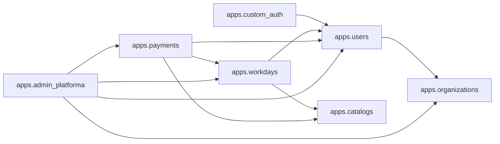

# 05 — Building Block View

Vista estática de los bloques que componen el sistema. Whitebox de
primer nivel.

## Diagrama de alto nivel

```mermaid
graph TB
  subgraph Frontend [React 19 + Vite + shadcn/ui]
    LP[Login Page]
    MD[Maestro Dashboard]
    TD[Trabajador Dashboard]
    AD[Admin Dashboard]
    AS[authStore Zustand]
  end

  subgraph Backend [Django 6 + DRF + SimpleJWT]
    AT[auth/token, /refresh, /logout, /me]
    ORG[organizations]
    USR[users + WorkerProfile]
    CAT[catalogs (4 modelos)]
    WD[workdays + MovimientoDeuda]
    PAY[payments + Liquidacion snapshot]
    ADM[admin plataforma metrics]
  end

  LP --> AT
  MD --> WD
  TD --> WD
  AD --> ADM

  WD --> PAY
  USR --> ORG
  PAY --> USR
```

## Backend — apps Django (whitebox)

Cada app es un bounded context. Las dependencias entre apps son
explícitas y unidireccionales.



### apps.organizations

| Bloque | Tipo | Responsabilidad |
|--------|------|-----------------|
| `Organization` | Model | Tenant. Tiene `is_active`, `name`, `slug`. |
| `OrganizationSerializer` | Serializer | CRUD básico. |
| `OrganizationViewSet` | ViewSet | Read + Create (admin plataforma). |

### apps.users

| Bloque | Tipo | Responsabilidad |
|--------|------|-----------------|
| `User` | Model | Custom AbstractUser. `email` como USERNAME_FIELD. |
| `WorkerProfile` | Model | 1:1 con User. Tiene `id_document`, `hire_date`, `is_active`. |
| `WorkerRate` | Model | Tarifa histórica del trabajador. `valid_from`, `amount`, `is_active`. |
| `UserManager` | Manager | `create_user` con email en vez de username. |
| `UserViewSet` | ViewSet | CRUD limitado. |
| `IsAdminPlataforma` | Permission | `is_staff=True AND organization_id=None`. |
| `IsSameOrganization` | Permission | Verifica que obj.organization == user.organization. |

### apps.custom_auth

| Bloque | Tipo | Responsabilidad |
|--------|------|-----------------|
| `CustomTokenObtainPairView` | View | Devuelve access + refresh + cookie. |
| `CustomTokenRefreshView` | View | Rota refresh + blacklistea el viejo. |
| `LogoutView` | View | Blacklisteaa refresh + limpia cookie. |
| `MeView` | View | Devuelve el usuario autenticado actual. |

### apps.catalogs

| Bloque | Tipo | Responsabilidad |
|--------|------|-----------------|
| `CatalogBase` | Abstract | Base para catálogos: `name`, `order`, `is_active`, FK `organization`. |
| `WorkdayType` | Model | Tipo de jornada (`Día completo`, `Medio día`, `Hora extra`). Tiene `factor` (multiplicador). |
| `PaymentStatus` | Model | Estado del pago (`Pendiente`, `Parcial`, `Pagado`). |
| `TipoMovimientoDeuda` | Model | Tipo de movimiento (`Préstamo`+balance, `Abono`-balance, `Ajuste`+balance). |
| `PaymentMethod` | Model | Método de pago (`Efectivo`, `Transferencia`, `Nequi`, `Daviplata`). |

### apps.workdays

| Bloque | Tipo | Responsabilidad |
|--------|------|-----------------|
| `Workday` | Model | Una jornada. FK a `WorkerProfile`, `WorkdayType`, `PaymentStatus`. `applied_rate` auto-calculado. |
| `WorkdayViewSet` | ViewSet | CRUD con `select_related` para multi-tenant + perf. |
| `WorkdaySerializer` | Serializer | Incluye `applied_rate` calculado en `perform_create`. |

### apps.payments

| Bloque | Tipo | Responsabilidad |
|--------|------|-----------------|
| `Liquidacion` | Model | Snapshot inmutable. `consecutivo`, `detalle` JSONField, `subtotal`, `descuento`, `total_pagado`. |
| `MovimientoDeuda` | Model | Movimiento individual. `signed_amount` property. |
| `PaymentWorkdayDetail` | Model | Join: qué Workday entra en qué Liquidacion. |
| `PaymentLoanDetail` | Model | Join: qué MovimientoDeuda se pagó con qué Liquidacion. |
| `services.liquidacion` | Service | **Transacción R6**: valida, calcula, crea Liquidacion, bloquea jornadas, genera Abono si descuento. |
| `LiquidacionViewSet` | ViewSet | ReadOnly + `@action liquidar`. |
| `MovimientoDeudaViewSet` | ViewSet | ModelViewSet. |
| `PaymentWorkdayDetailViewSet` | ViewSet | ReadOnly (audit). |
| `PaymentLoanDetailViewSet` | ViewSet | ReadOnly (audit). |

### apps.admin_platforma

| Bloque | Tipo | Responsabilidad |
|--------|------|-----------------|
| `metrics` | View | Endpoint `GET /api/admin/metrics/`. Sólo AdminPlataforma. |

## Frontend — estructura

```
frontend/src/
├── api/
│   ├── authService.js
│   ├── catalogsService.js
│   ├── liquidacionesService.js      # Fase 5
│   ├── movementsService.js
│   ├── organizationsService.js
│   ├── usersService.js
│   └── workdaysService.js
├── components/
│   ├── ui/                          # shadcn primitives
│   ├── Maestro/                     # vistas del maestro
│   │   ├── AsistenteLiquidacion.jsx
│   │   ├── ComprobanteLiquidacion.jsx
│   │   └── ...
│   ├── Trabajador/                  # vistas del trabajador
│   └── Admin/                       # vistas del admin plataforma
├── context/
│   └── DataContext.jsx              # estado global (con useBackend flag)
├── store/
│   └── authStore.js                 # Zustand: accessToken + user
├── pages/                           # rutas
└── lib/
    ├── auth.js
    ├── api.js
    └── calculo.ts                   # LEGACY: cálculo client-side
```

## Reglas de dependencia entre bloques

1. `apps.payments` puede importar de `apps.workdays`, `apps.users`,
   `apps.catalogs`, `apps.organizations`.
2. `apps.workdays` puede importar de `apps.users`, `apps.catalogs`,
   `apps.organizations`.
3. `apps.users` puede importar de `apps.organizations`.
4. `apps.admin_platforma` puede importar de TODOS (es el único que
   traspasa el multi-tenant).
5. Ningún app importa de `apps.admin_platforma` (es top-level).

Estas reglas previenen ciclos y mantienen el grafo de dependencias
acíclico (DAG).
