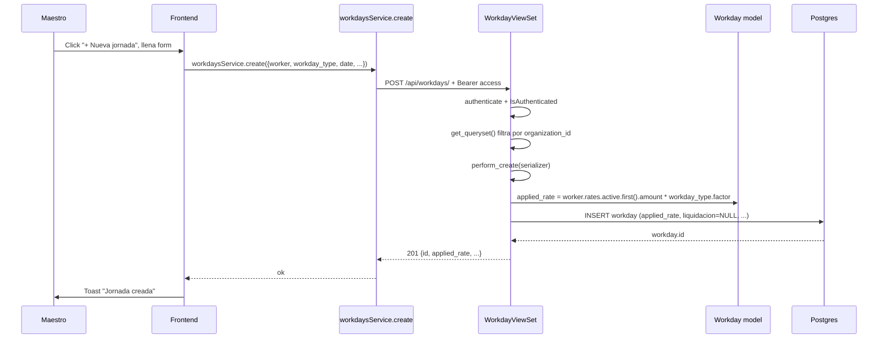
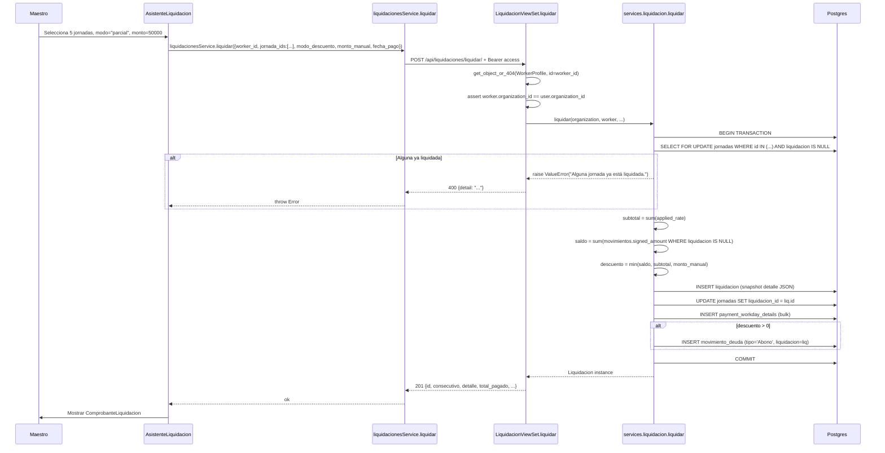
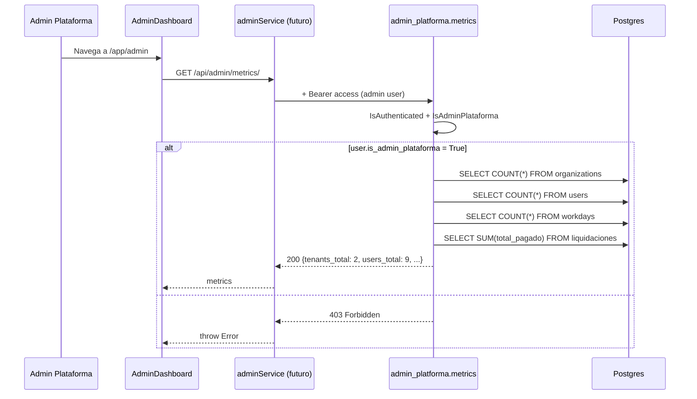

# 06 — Runtime View

Comportamiento dinámico del sistema: los escenarios más importantes
expresados como interacciones entre los bloques.

## Escenario 1: Login de un maestro

```mermaid
sequenceDiagram
  participant U as Usuario (browser)
  participant F as Frontend (React)
  participant A as authService.login
  participant B as Backend (DRF)
  participant DB as Postgres
  participant Z as authStore (Zustand)

  U->>F: Ingresa email + password en /login
  F->>A: authService.login({email, password})
  A->>B: POST /api/auth/token/ {email, password}
  B->>DB: SELECT user WHERE email=? AND password=?
  DB-->>B: user row
  B-->>A: {access: "eyJ...", refresh: "abc"}
  A->>B: Set-Cookie: refresh_token=abc; HttpOnly; SameSite=Lax
  B-->>A: 200 OK
  A->>Z: setAccessToken(eyJ...)
  A->>Z: setUser({email, is_staff, organization_id})
  A-->>F: ok
  F->>U: redirect /app/maestro
```

Tras el login:
- El access token vive en memoria (Zustand) + Authorization header en
  cada request subsecuente.
- El refresh token vive en cookie HttpOnly — JS no puede leerlo.
- Si el access expira (5 min), `api.js` llama a `POST /api/auth/refresh/`
  que lee la cookie, devuelve un nuevo access, y rota el refresh.

## Escenario 2: Maestro registra una jornada



Notas:
- `applied_rate` lo calcula el backend, no el frontend. El frontend
  puede enviar `applied_rate` opcional pero si no, se calcula del
  último `WorkerRate` activo del trabajador × `factor` del tipo.

## Escenario 3: Liquidar un período (R6)



Notas:
- Toda la operación es **atómica**. Si algo falla, nada se persiste.
- `SELECT FOR UPDATE` sobre las jornadas previene doble liquidación
  concurrente del mismo período.
- Si `descuento > 0`, se crea automáticamente un MovimientoDeuda de
  tipo `Abono` vinculado a la liquidación, así el saldo del trabajador
  queda consistente.

## Escenario 4: Trabajador consulta sus liquidaciones

```mermaid
sequenceDiagram
  participant T as Trabajador
  participant F as TrabajadorDashboard
  participant S as liquidacionesService.list
  participant V as LiquidacionViewSet
  participant DB as Postgres

  T->>F: Navega a /app/trabajador/comprobantes
  F->>S: liquidacionesService.list({worker_id: self})
  S->>V: GET /api/liquidaciones/ + Bearer access
  V->>V: get_queryset() — user.is_admin_plataforma? NO; user.organization_id? maybe; hasattr(user, 'worker_profile')? SÍ
  V->>V: qs.filter(worker_id=user.worker_profile.id)
  V->>DB: SELECT liq.* FROM liquidaciones WHERE worker_id=? ORDER BY fecha_pago DESC
  V-->>S: 200 [{id, consecutivo, total_pagado, ...}]
  S-->>F: array
  F->>T: Mostrar lista de comprobantes
```

Notas:
- El trabajador **NO ve otros trabajadores** (multi-tenant estricto).
- `prefetch_related('workday_details', 'loan_details')` evita N+1
  cuando se serializa cada liq.

## Escenario 5: Admin plataforma ve métricas



Notas:
- `IsAdminPlataforma` valida `is_staff=True AND organization_id=None`.
- Los queries son agregados simples (COUNT, SUM). Sin N+1 porque no
  hay iteración.
