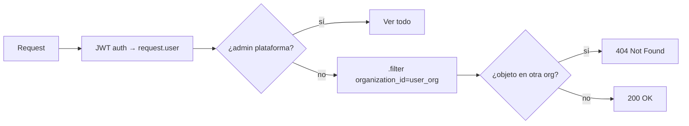
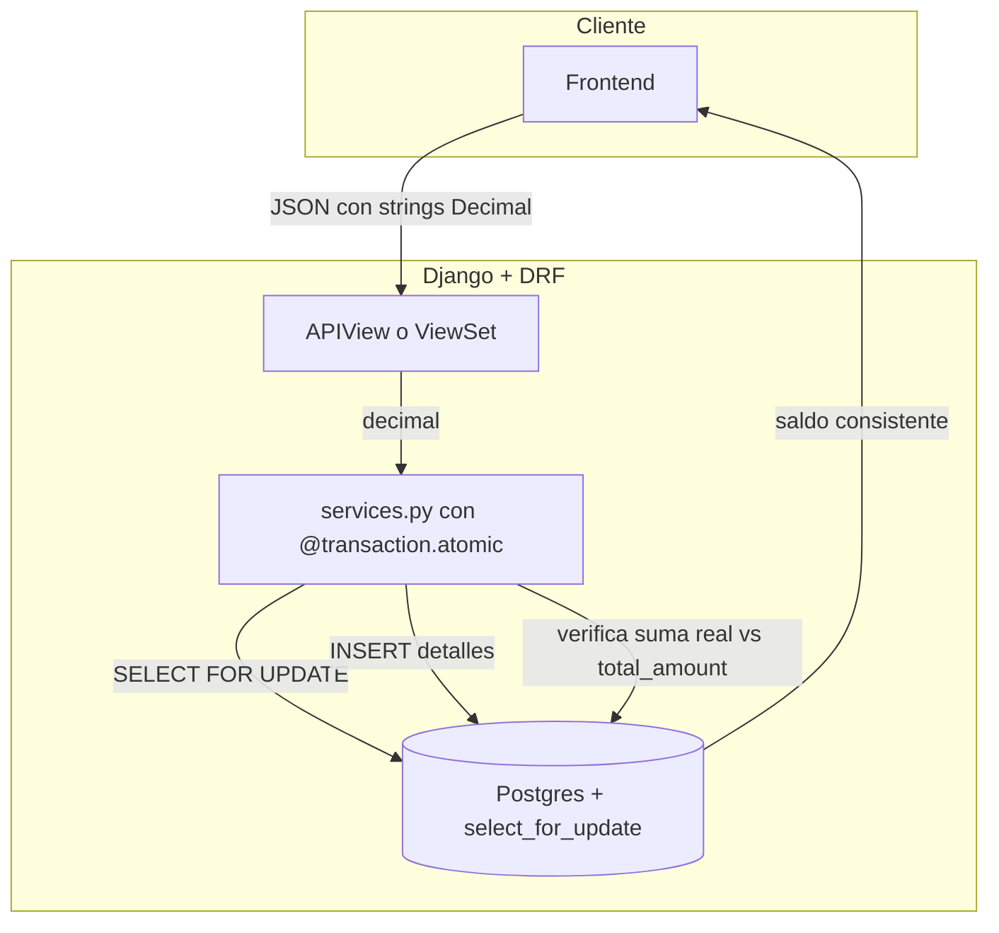
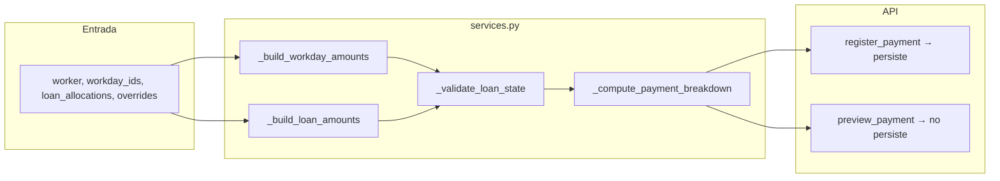
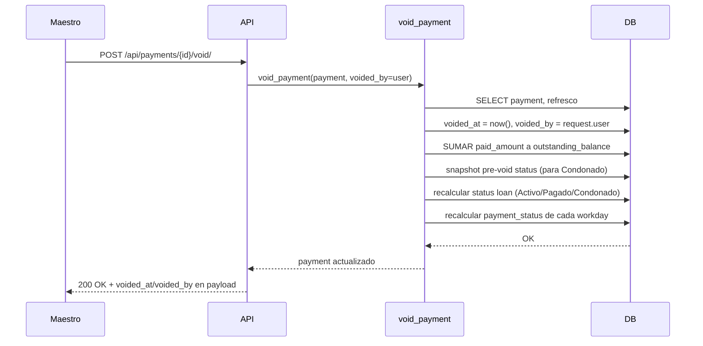

# 08 · Conceptos transversales

> [← Volver al índice](../README.md)

Soluciones que **atraviesan varios bloques**. Si algo aparece en más de
un módulo, vive aquí; si aparece solo en uno, vive en la sección 5.

Esta es la sección más importante del proyecto: documenta lo que no
se deduce leyendo el código y lo que rompería la lógica de negocio si
alguien lo cambia sin entenderlo.

## Índice de esta sección

| Tema | Qué cubre | Dónde está en el código |
|------|-----------|--------------------------|
| [Multi-tenancy](#multi-tenancy) | Filtro por organización, dónde se aplica, por qué cross-org es 404 | `apps/*/api/viewsets.py:153` `_ScopedQsMixin`, `apps/payments/exception_handler.py` |
| [Modelo canónico de dinero](#modelo-canónico-de-dinero) | `Decimal` en todo, `atomic + select_for_update`, `outstanding_balance` solo dentro del servicio | `apps/payments/services.py`, `apps/payments/exceptions.py` |
| [Preview vs register](#preview-vs-register) | Una sola regla de cálculo, el preview no persiste, las dos se llaman igual | `apps/payments/services.py` (`_compute_payment_breakdown`), `apps/payments/api/viewsets.py:399` (`PreviewPaymentView`) |
| [Anulación soft-delete](#anulación-soft-delete) | `voided_at` + `voided_by`, reversa de saldos, restaurar Condonado | `apps/payments/services.py:416` (`void_payment`) |
| [Manejo de errores HTTP](#manejo-de-errores-http) | Excepciones de dominio → status codes, sin leak de información | `apps/payments/exception_handler.py` |
| [Auditoría y soft-delete de dinero](#auditoría-y-soft-delete-de-dinero) | Lo que ve la pantalla cuando un pago se anula | `apps/payments/api/viewsets.py:112` (`PaymentDetailSerializer`) |

---

## Multi-tenancy

JornalPro es un SaaS multi-tenant con **schema compartido** y filtro por
`organization_id` en cada queryset sensible. No hay un schema Postgres
por tenant; hay una sola BD y la columna `organization_id` en `User`
que se propaga a las tablas hijas vía JOIN.

**Reglas:**

1. **Filtro siempre**: todo queryset que devuelva datos de un tenant
   DEBE terminar con `.filter(worker__user__organization_id=user_org)`
   (o equivalente para tablas que no tienen worker). Se aplica
   sistemáticamente en `_ScopedQsMixin.get_queryset` para evitar que
   un endpoint nuevo olvide el filtro.
2. **Cross-org = 404, no 403**: cuando el caller pide un objeto que
   pertenece a otra organización, respondemos `404` (no `403`) para
   no confirmar la existencia del recurso. El helper
   `_ensure_worker_in_callers_org` en `viewsets.py` lo aplica
   uniformemente.
3. **Admin plataforma se exenta**: usuarios con `is_staff=True` Y
   `organization=None` ven TODOS los tenants (modo soporte).

**Dónde se aplica el filtro:**



**Excepciones documentadas:**

- `GET /api/auth/me/`: lee `user.organization_id` directamente, sin
  queryset — no es cross-org por construcción.
- `GET /api/catalogs/`: catálogos compartidos por todas las orgs (la
  FK `organization` es opcional).

Si añades un endpoint nuevo que devuelva datos de un tenant, usa
`_ScopedQsMixin` o aplica el filtro manualmente y documenta la razón
si no lo haces.

---

## Modelo canónico de dinero

El módulo `apps.payments` mueve dinero de verdad: saldos de préstamos,
pagos de jornadas, anulaciones. Cualquier error de redondeo, carrera
entre peticiones concurrentes, o mutación externa del saldo es un bug
que se paga caro en producción. Por eso las reglas son duras y viven
solo en `services.py`:

### Regla 1: `Decimal` en todo, jamás `float`

```python
from decimal import Decimal
balance = Decimal("0.00")  # ✅
balance = 0.0              # ❌ float: introduce drift binario
```

DRF devuelve números como `Decimal` por los campos `DecimalField`, y
los servicios validan los montos con `_cents()` (redondeo HALF_UP a 2
decimales) en cada entrada. Los serializers exponen los montos como
**string** (`str(Decimal)`) en el payload para que el cliente no los
pase por `Number()` (que es FP en JS y reintroduciría el drift).

### Regla 2: `atomic` + `select_for_update` obligatorio

Toda mutación de saldo (`register_payment`, `void_payment`,
`create_loan`) está dentro de `@transaction.atomic` y carga las filas
a modificar con `.select_for_update()`:

```python
@transaction.atomic
def register_payment(...):
    workdays = list(Workday.objects.select_for_update().filter(...))
    loans = list(Loan.objects.select_for_update().filter(...))
    # ... calcular, persistir, recalcular ...
```

`select_for_update` toma un lock en la fila a nivel Postgres. Dos
peticiones concurrentes sobre el mismo préstamo se serializan: la
segunda ve el saldo actualizado de la primera y rechaza con
`LoanOverpaymentError` si se queda sin saldo. Esto es lo que el test
`test_register_payment_concurrent_no_negative_balance` fija — si
alguien quita el `select_for_update`, ese test rompe.

### Regla 3: `outstanding_balance` solo muta dentro del servicio

El campo `Loan.outstanding_balance` NUNCA se escribe desde una vista,
un signal, un shell de admin, ni una migración. Solo `create_loan`,
`register_payment` (al aplicar abonos) y `void_payment` (al revertir)
pueden tocarlo. Cualquier cambio por otra vía rompe la auditoría.

### Regla 4: Consistencia verificada desde BD

Después de persistir los detalles de un pago (`PaymentWorkdayDetail`,
`PaymentLoanDetail`), el servicio **relee** la suma real desde la BD y
la compara contra `Payment.total_amount`. Si difiere (corrupción,
truncamiento, intervención externa), lanza
`InconsistentPaymentTotalError` y aborta la transacción con un 500
visible. Esto convierte "el total no cuadra" de un bug silencioso a
un error detectable.

### Diagrama



---

## Preview vs register

La pantalla de liquidación del maestro necesita mostrar el costo de
un pago **antes** de confirmar. La regla de cálculo del pago es no
trivial (jornadas con override + abonos a préstamos + saldo
disponible) y la UI no puede sumar por su cuenta — eso sería código
de negocio en el cliente, que es justo lo que el plan prohíbe.

**Solución: misma función pura, dos wrappers.**



- **`_compute_payment_breakdown`** es la función pura que recibe los
  pares ya validados y devuelve el subtotal, los abonos y el saldo
  resultante. No toca BD.
- **`register_payment`** la llama después de persistir.
- **`preview_payment`** la llama y devuelve el breakdown al cliente
  sin persistir nada.

**Garantía:** el preview y el register usan exactamente las mismas
funciones puras. Si divergen, es bug — el test
`test_preview_payment_matches_register_payment_mixed_input` lo fija.

**Por qué importa para auditoría:** si la regla de cálculo viviera
duplicada en cliente y servidor, un cambio en uno sin actualizar el
otro haría que la pantalla le mienta al maestro. Aquí la regla vive
en un solo sitio.

---

## Anulación soft-delete

Anular un pago NO lo borra. Lo marca con `voided_at` + `voided_by`,
revierte los abonos a los préstamos y recalcula el estado de las
jornadas afectadas. El pago sigue en la BD para auditoría.



**Garantías:**

1. **`voided_at` es `timezone.now()`**, no `created_at` ni la fecha
   del pago. La auditoría ve cuándo se anuló, no cuándo se creó.
2. **`voided_by` es requerido** — no se puede anular sin usuario
   identificado.
3. **Doble void → `PaymentAlreadyVoidedError` (409)** — la segunda
   anulación es un bug, no un no-op.
4. **Restauración de Condonado**: si el préstamo estaba Condonado
   *antes* del pago que ahora se anula, vuelve a Condonado (no a
   Activo aunque su saldo vuelva a ser > 0). Esto preserva la
   decisión humana de condonación.

El payload del pago anulado expone ambos campos al frontend para
que pinte "Anulado el 12/03 por Ana Pérez" sin segunda petición.

---

## Manejo de errores HTTP

`apps/payments/exception_handler.py` mapea excepciones de dominio a
status codes consistentes. Las vistas y serializers no escriben
`Response(status=400)` para errores de negocio: lanzan la excepción
apropiada y dejan que el handler la convierta.

| Excepción | Status | Razón |
|-----------|--------|-------|
| `CrossOrganizationError` | 404 | No leak: existencia del recurso confirmada |
| `OverpaymentError` | 409 | El monto aplicado excede el `applied_rate` |
| `LoanOverpaymentError` | 409 | El abono excede `outstanding_balance` |
| `PaymentAlreadyVoidedError` | 409 | Doble void |
| `WorkdayAlreadyPaidError` | 409 | Estado del recurso no permite la operación |
| `NoActiveRateError` / `OverlappingRateError` | 400 | Entrada inválida |
| `InconsistentPaymentTotalError` | 500 | Corrupción de BD detectada — alertar |
| `IntegrityError` (unique_together) | 409 | Concurrencia o bug |

---

## Auditoría y soft-delete de dinero

Cuando un pago se anula, la pantalla del historial debe poder pintar
"anulado el 12/03 por Fulano". Para eso el serializer expone, además
del `total_amount`:

- `voided_at`: ISO timestamp de la anulación, o `null` si está vigente.
- `voided_by`: **nombre legible** del usuario (`User.name` del
  proyecto), no el id. Evita una segunda petición por fila.
- `workday_details`: lista de jornadas cubiertas con `id`,
  `applied_amount`, `workday.date`, `workday.workday_type.name`.
- `loan_details`: lista de abonos con `paid_amount`, `loan.id`,
  `loan.reason`.

Y análogamente, `LoanSerializer.payment_details` lista los abonos
recibidos por un préstamo con su `payment_date` para el historial
"cuándo y cuánto se ha abonado".

> Los serializers están optimizados con `select_related` y
> `prefetch_related` (`_ScopedQsMixin._optimize`) para que listar N
> pagos no dispare N+1. El test
> `test_payment_list_query_count_is_constant` fija el techo.
